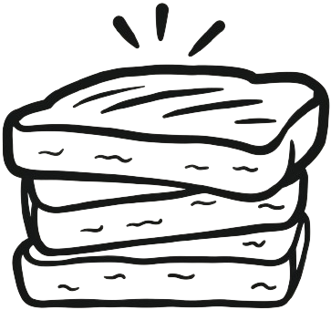

# sourdough-toast

A plain JavaScript toast notification library inspired by [Sonner](https://sonner.emilkowal.ski).

[Demo and usage](https://sourdough-toast.vercel.app/example)

```js
import { Sourdough, toast } from "sourdough-toast";

const sourdough = new Sourdough();
window.addEventListener("DOMContentLoaded", () => sourdough.boot());

toast("Saved");
toast("Pin this until I close it", { persist: true });
```

Persistent toasts stay visible until dismissed, always show a close button, and do not count toward `maxToasts`.

## License

MIT
